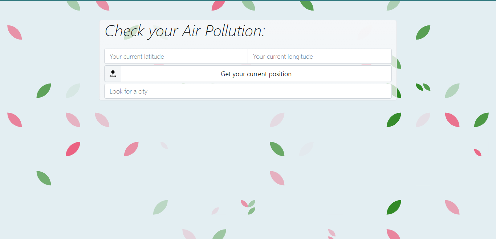
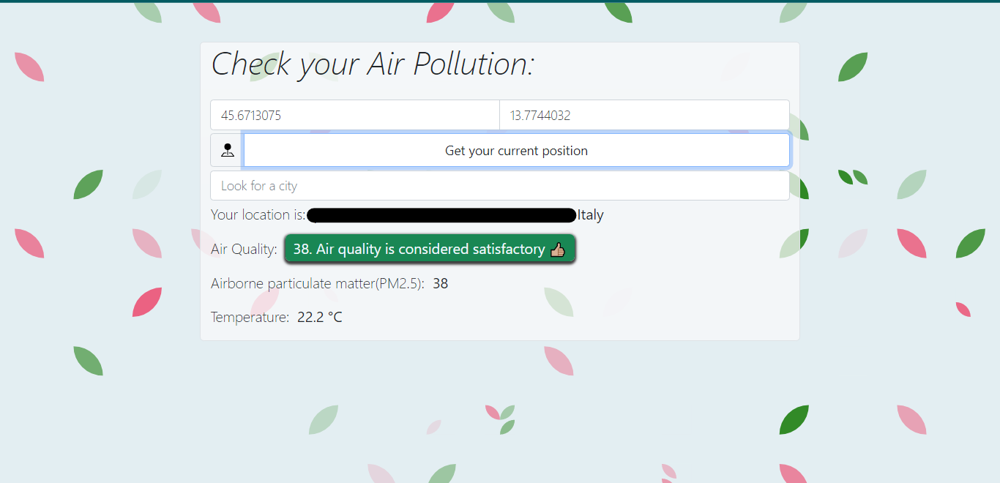
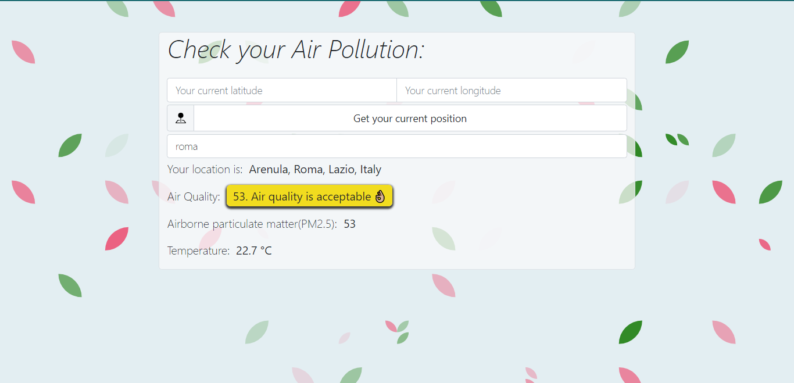

# 🌍 AQI App 

The AQI app is a simple project to check your air pollution, based on your geolocation (after having given your browser permission) or by searching for a city you prefer.

## 🛠 Installation

1. Open Git Bash

2. Change the current working directory to the location where you want the 
   cloned directory.

3. Type git clone, and then paste the URL you copied earlier

``
git clone https://github.com/LeoBok/air-pollution.git
``

4. Once cloned, in the terminal of your Editor (in my case is VS Code) run ``npm run start`` to start webpack-dev-server

## 📸 Screenshots

This is what you see at the very beginning when opening the app:

This is what you see when clicking on the ``Get you current position`` button:

This is what you see when you search in ``Look for a city`` input:

## 🧱 Build with
- HTML
- CSS & Bootstrap
- Javascript
- NPM
- Webpack

## Author

**Leonardo Boccali**
- [Profile](https://github.com/LeoBok)
- [Email](mailto:leonardoboccali19@gmail.com?)